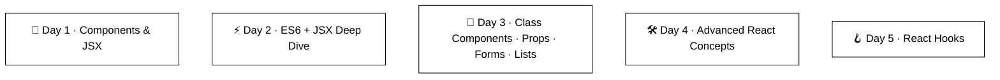

# ⚛️ React Learning Journey 🚀

A structured **5-Day React Learning Journey** covering React fundamentals, advanced concepts, styling, routing, and modern React Hooks.

The learning approach followed in this repository:

> **Concept → Implementation → Mini Task**

---

# 🔭 Project Overview

This curriculum follows a progressive learning path from React basics to advanced React concepts.



---

# 📚 React Learning Roadmap

## 📅 Progress Tracker

| Day | Topics | Status |
|---|---|---|
| 🚀 Day 1 | Components, JSX | ✅ Done |
| ⚡ Day 2 | ES6, JSX, Conditionals | ✅ Done |
| 🧱 Day 3 | Class Components, Props, Events, Lists, Forms | ✅ Done |
| 🛠️ Day 4 | Portals, Lazy/Suspense, CSS Modules, CSS-in-JS, Router, Sass | ✅ Done |
| 🪝 Day 5 | useState, useEffect, useRef, useContext, useReducer, useMemo, useCallback, Custom Hooks | ✅ Done |

---

# 📁 Project Folder Structure

```
React-Learning-Journey/

│
├── src/
│   │
│   └── lessons/
│       │
│       ├── Day1/
│       │   ├── Components/
│       │   └── JSX/
│       │
│       ├── Day2/
│       │   ├── ES6/
│       │   ├── JSX-Expressions/
│       │   └── Conditional-Rendering/
│       │
│       ├── Day3/
│       │   ├── Class-Components/
│       │   ├── Props/
│       │   ├── Events/
│       │   ├── Lists/
│       │   └── Forms/
│       │
│       ├── Day4/
│       │   ├── React-Portals/
│       │   ├── Lazy-Suspense/
│       │   ├── CSS-Modules/
│       │   ├── CSS-in-JS/
│       │   ├── React-Router/
│       │   └── Sass/
│       │
│       └── Day5/
│           ├── useState/
│           ├── useEffect/
│           ├── useRef/
│           ├── useContext/
│           ├── useReducer/
│           ├── useMemo/
│           ├── useCallback/
│           └── Custom-Hooks/

```

---

# 📖 Day-wise Topics

# 🚀 Day 1 — Components & JSX

## Components

Topics Covered:

- React Components
- Functional Components
- Reusable Components
- Component Composition

## JSX

Topics Covered:

- JSX Syntax
- JSX Expressions
- JavaScript inside JSX
- JSX Rules

---

# ⚡ Day 2 — ES6 + JSX Deep Dive

## ES6 Features

Topics Covered:

- let & const
- Arrow Functions
- Template Literals
- Destructuring
- Spread Operator
- Rest Operator
- Array Methods

## JSX Concepts

Topics Covered:

- JSX Expressions
- Attributes
- Dynamic Values
- Conditional Rendering

---

# 🧱 Day 3 — Components, Props, Events & Forms

## Class Components

Topics Covered:

- Class Component Structure
- Lifecycle Introduction

## Props

Topics Covered:

- Passing Data Between Components
- Props Destructuring
- Children Props

## Events

Topics Covered:

- Event Handling
- Click Events
- Synthetic Events

## Lists

Topics Covered:

- Rendering Arrays
- map()
- Keys in React

## Forms

Topics Covered:

- Input Forms
- Textarea
- Select Dropdown
- Checkbox Forms
- Radio Forms

---

# 🛠️ Day 4 — Advanced React Concepts

## React Portals

Learned:

- Rendering components outside DOM hierarchy
- Modal creation
- Popup handling

---

## Lazy Loading & Suspense

Learned:

- Code Splitting
- Dynamic Imports
- Performance Optimization

Example:

```jsx
const Home = lazy(() => import("./Home"));
```

---

# Styling in React

## CSS Modules

Covered:

- Scoped CSS
- Component-level styling

## CSS-in-JS

Using:

- styled-components

## Sass / SCSS Modules

Covered:

- Variables
- Nesting
- Mixins

---

# React Router

Topics Covered:

- Routes
- Navigation
- Dynamic Routes
- Nested Routes

---

# 🪝 Day 5 — React Hooks

## useState()

Used for:

- Managing component state
- Updating UI dynamically

---

## useEffect()

Used for:

- API calls
- Side effects
- Timers
- Lifecycle handling

---

## useRef()

Used for:

- DOM references
- Mutable values
- Avoiding unnecessary renders

---

## useContext()

Used for:

- Global state sharing
- Theme management
- Sharing data between components

---

## useReducer()

Used for:

- Complex state logic
- Multiple state actions

---

## useMemo()

Used for:

- Memoizing expensive calculations
- Performance optimization

---

## useCallback()

Used for:

- Memoizing functions
- Preventing unnecessary renders

---

## Custom Hooks

Creating reusable logic.

Examples:

```javascript
useFetch()
useAuth()
useLocalStorage()
```

---

# 🛠️ Technologies Used

## Frontend

- React 18
- JavaScript ES6+
- JSX
- React Router
- CSS Modules
- Sass
- styled-components

## Tools

- Vite
- VS Code
- Git
- GitHub

---

# 🎯 Learning Goals

By completing this repository:

✅ Understand React fundamentals  
✅ Build reusable components  
✅ Handle events and forms  
✅ Manage application state  
✅ Use modern React Hooks  
✅ Create scalable React applications  
✅ Improve frontend development skills  

---

# 📌 Future Learning

Upcoming Topics:

- Redux Toolkit
- React Query
- Authentication
- Testing
- Performance Optimization
- Deployment

---

# 📊 Current Progress

```
React Fundamentals        ✅
Components                ✅
JSX                       ✅
Props                     ✅
Forms                     ✅
Routing                   ✅
Advanced Styling          ✅
React Hooks               ✅
State Management          ⏳
Testing                   ⏳
Deployment                ⏳
```

---

# 👩‍💻 Author

**Asiya Mujawar**

Building React Development Skills 🚀
